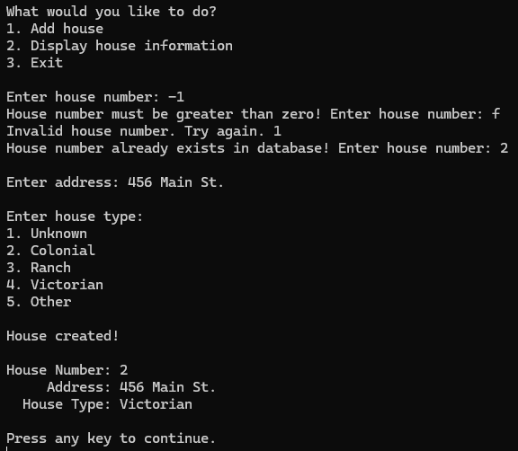

Implement a single linked list with each node representing a house. 
Add data in it like house number, brief address, type of house (like Ranch, Colonial, etc). 
Each house (node) will be linked to next.
Allow the user to search a house by its number and then display the details.
Can be a WinForms or Console app.

---
### Code Output:
#### Trying to search for and display information for a house when the list is empty:
> 

#### Adding the first house:
> 

#### Adding the second house:
> 

#### Trying to search and display information for a house that does not exist:
> 

#### Trying to search and display information for a house that exists:
> 
